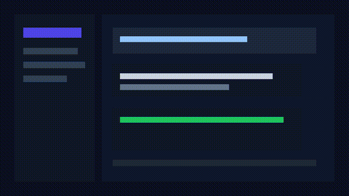

# CodeHarbor



CodeHarbor is a local-first Go MVP for an AI coding agent server. It ships as a single Go service with SQLite persistence, provider abstractions, core coding tools, WebSocket events, a PTY terminal bridge, Agent Server and MCP server registries, and a simple embedded web UI.

The project is currently an experimental MVP. It is intended for local development and iteration, not for untrusted multi-user or production deployments.

> **Real local dogfood:** the current code has been run end-to-end against temporary local projects. The latest tracked-file smoke created a project through the HTTP API, edited a tracked file with the `Write` tool, reviewed the resulting Git diff, and committed only the selected path. See [Dogfood demo](#dogfood-demo).

## Features

- Local HTTP server with embedded HTML/CSS/JS UI, using a no-build ES module seam for frontend bootstrap/runtime helpers and extracted Settings local preference panels
- SQLite persistence for projects, chapters, narrators, messages, tool calls, backend registry entries, and stdio MCP server registry entries
- Provider abstraction for:
  - OpenAI official Responses API with SDK streaming text deltas and usage capture
  - Anthropic official Messages API with SDK streaming text deltas, tool-use deltas, usage capture, and automatic 5m prompt-cache breakpoints for sufficiently large requests
  - OpenAI-compatible Chat Completions APIs
  - CLIProxyAPI local OpenAI-compatible preset
- Core tools:
  - Read
  - Write
  - Edit
  - Bash
  - Glob
  - Grep
  - WebFetch
  - WebSearch
  - MCPListTools
  - MCPCallTool
- Git workspace APIs and UI for status, diff, log, and explicit-path commits without automatic push, amend, reset, clean, force, or `git add -A`
- WebSocket agent event stream: `/ws/narrator` with Settings → AI Agents current narrator controls for model, permission mode, and working directory
- Settings → Chapters & Containers project workline view backed by project chapter/narrator APIs, with backend chapter fork support that creates Git worktrees, merge-check preflight, and clean-worktree merge APIs
- Interactive PTY terminal WebSocket: `/ws/terminal` with Settings → Terminal management controls and browser-local retention/focus preferences
- Filesystem browse/preview/mkdir APIs
- Agent Server backend registry with sidebar and Settings → Agent Admin management UI for compatible OpenHands Agent Server endpoints
- Settings modal search/filter with keyboard focus shortcut for quickly locating growing product configuration panels
- Chat message copy actions for exporting individual messages and the current conversation as Markdown
- Browser-local chat draft autosave/restore per narrator, including migration through local preference backups
- Browser-local prompt history for the chat composer, with empty-input ↑/↓ recall and migration through local preference backups
- Chat composer slash command palette backed by enabled local Skills command templates
- Browser-local Settings → Profile preferences for display identity, avatar initials, workspace label, and Git identity helpers
- Browser-local Settings → Network Search policy preferences for provider presets, result limits, confirmation, and domain rules, plus `WebSearch` and `WebFetch` core tools for public web/documentation lookup
- Browser-local Settings → IM Gateway integration policy preferences for webhook/bot presets, confirmation, signatures, redaction, and event routing
- Browser-local Settings → Skills workbench for slash command templates, MCP server drafts, tool policy notes, and JSON export; it can create/enable/delete persisted stdio MCP registry entries, run `tools/list` discovery, and let core tools list/call registered MCP servers with explicit exec-risk approval
- Browser-local Settings → Notifications preferences for toast categories, display duration, and UI terminal notices
- Browser-local Settings → Appearance preferences for theme, density, terminal default visibility, and agent event log display
- Runtime summary endpoint and Settings → Servers/System + Runtime panels for process, Go runtime, paths, and agent limits
- Settings → Users read-only auth status panel backed by `/api/auth/status`
- Local storage summary endpoint and Settings → Storage panel for config, database, home, and project directory footprint
- Local usage summary endpoint and Settings → Usage panel for projects, messages, tool calls, model requests, estimated token cost, and backends
- Settings → About dependency license panel backed by the development-time `/api/licenses` endpoint
- Settings → About browser-local preferences backup/import for migrating profile, skills, chat drafts, prompt history, search, IM, notification, appearance, terminal, recent directory, model, and relay protocol settings

## Requirements

- Go 1.26 or newer, as declared in `go.mod`
- SQLite is provided through the pure-Go `modernc.org/sqlite` driver
- Node.js is optional and only used for `node --check` on embedded frontend scripts during validation

## Install

For tagged releases, the GoReleaser workflow builds macOS, Linux, and Windows archives named like `codeharbor_<version>_<os>_<arch>`. Download the matching archive from GitHub Releases, unpack it, then run the `codeharbor` binary.

From source:

```bash
go run ./cmd/codeharbor
```

Then open:

```text
http://localhost:7788
```

Default paths:

```text
Config:   ~/.codeharbor/config.json
Database: ~/.codeharbor/codeharbor.db
Projects: ~/projects
```

You can pass a custom config path:

```bash
go run ./cmd/codeharbor --config /path/to/config.json
```

## Dogfood demo

Local API-only dogfood smokes were run against temporary CodeHarbor servers and temporary Git repositories. The workflow creates a project through `POST /api/projects`, executes tools through `POST /api/narrators/{id}/tool-calls`, reviews Git state through `GET /api/narrators/{id}/git/status` and `GET /api/narrators/{id}/git/diff`, then commits only selected files through `POST /api/narrators/{id}/git/commit` with an explicit `paths` list.

Latest tracked-file run on 2026-07-07 UTC / 2026-07-08 +08:00:

```text
Write: Wrote 197 bytes to demo/notes.md inside the temporary project worktree
Read:  confirmed the new tracked diff review line
Grep:  notes.md:4:- Updated through CodeHarbor Write tool for tracked diff review.
Status before commit: demo/notes.md was tracked and modified (worktree=M)
Diff:  demo/notes.md added=2 deleted=0
Patch excerpt:
  diff --git a/demo/notes.md b/demo/notes.md
  +- Updated through CodeHarbor Write tool for tracked diff review.
Commit: 96cd79e Dogfood tracked diff workflow
Paths:  demo/notes.md
After commit: clean=true, remainingFiles=[]
```

An earlier untracked-file smoke also created and committed `demo/notes.md` with commit `2484ab7 Dogfood CodeHarbor API workflow`.

The README hero currently uses a lightweight tracked `docs/demo.gif` workflow preview. To replace it with a real product recording, capture a 15-20 second browser flow (create/open project → send task → approve tool call → review diff → commit selected path), compress it to a small GIF, and overwrite `docs/demo.gif`.

To reproduce manually, start CodeHarbor with a temporary config, create or open a local Git repository as the project worktree, use the UI or tool-call API to write a small file, verify Git status, inspect the diff in the Git panel, select the file checkbox, enter a commit message, and submit the commit. The commit API stages only the selected paths and does not push, amend, reset, clean, force, or auto-stage the full worktree.

## Usage cost estimates

CodeHarbor records provider usage in `api_requests` and shows aggregate estimated cost in Settings → Usage. Cost is calculated from a small built-in USD-per-million-token table in `internal/agent/loop.go`. The table was last reviewed on 2026-07-07 against public pricing pages: [OpenAI API pricing](https://developers.openai.com/api/docs/pricing), [OpenAI GPT-4.1 pricing announcement](https://openai.com/index/gpt-4-1/), and [Anthropic Claude pricing](https://docs.anthropic.com/en/docs/about-claude/pricing). Unknown models intentionally estimate to `0`, and OpenAI-compatible relay or local models may bill differently from their public model-name match.

## Configuration

On first run, CodeHarbor creates a local config file if it does not exist. Runtime secrets can be supplied through environment variables. `config.json` includes a schema `version` field; legacy configs without it are loaded as version `1` and normalized in memory.

Agent model environment variables:

```text
CODEHARBOR_DEFAULT_MODEL
CODEHARBOR_SUMMARY_MODEL
```

Provider environment variables:

```text
OPENAI_API_KEY
OPENAI_MODEL
ANTHROPIC_API_KEY
ANTHROPIC_MODEL
OPENAI_BASE_URL
OPENAI_COMPATIBLE_BASE_URL
OPENAI_COMPATIBLE_API_KEY
OPENAI_COMPATIBLE_MODEL
CLIPROXYAPI_BASE_URL
CLIPROXYAPI_API_KEY
CLIPROXYAPI_MODEL
CLIPROXYAPI_MANAGEMENT_KEY
CLIPROXYAPI_BIN
CLIPROXYAPI_CONFIG
```

### CLIProxyAPI preset

CodeHarbor includes a built-in `cliproxyapi` provider profile for local [CLIProxyAPI](https://github.com/router-for-me/CLIProxyAPI) instances:

```text
Provider: cliproxyapi
Type:     openai-compatible
Base URL: http://127.0.0.1:8317/v1
Model:    gpt-5.5
```

Start CLIProxyAPI, then use **Settings → Providers → Codex 凭证 + 中转站** inside CodeHarbor. Codex now uses credential import only: paste a Codex auth JSON, refresh token list, or token/account rows and import them directly into CLIProxyAPI; CodeHarbor refreshes CLIProxyAPI auth files and `/v1/models` afterwards. The same page also includes an embedded relay/provider form for API Key, Base URL, protocol selection, and default model. Saving the form updates CodeHarbor's runtime provider registry immediately and persists non-secret provider settings to `config.json`; API keys are intentionally not written to disk. You can pick a preferred model before creating a project, and CodeHarbor will use it for the new narrator. To make new projects use the preset by default, start CodeHarbor with `CODEHARBOR_DEFAULT_MODEL=cliproxyapi:gpt-5.5`. If your CLIProxyAPI config enables client `api-keys`, export `CLIPROXYAPI_API_KEY` before starting CodeHarbor. You can override the local endpoint or fallback model with `CLIPROXYAPI_BASE_URL` and `CLIPROXYAPI_MODEL`. CodeHarbor uses `CLIPROXYAPI_MANAGEMENT_KEY` for local management API calls; local previews default to `codeharbor-local`.

Agent Server backend seed variables:

```text
CODEHARBOR_AGENT_BACKEND_URL
CODEHARBOR_AGENT_BACKEND_NAME
CODEHARBOR_AGENT_BACKEND_KIND
CODEHARBOR_AGENT_BACKEND_API_KEY
OPENHANDS_AGENT_SERVER_URL
OPENHANDS_SESSION_API_KEY
AGENT_SERVER_URL
AGENT_SERVER_API_KEY
```

If a backend URL is configured, CodeHarbor seeds the backend registry on first startup. Local backends use `X-Session-API-Key`; cloud backends use `Authorization: Bearer ...`.

## API overview

Core routes include:

```text
GET  /api/health
GET  /api/auth/status
GET  /api/settings
GET  /api/models
GET  /api/licenses
GET  /api/runtime/summary
GET  /api/storage/summary
GET  /api/usage/summary

PUT  /api/providers/{name}/config

GET  /api/providers/cliproxyapi/auth-files
POST /api/providers/cliproxyapi/auth-files/import

GET    /api/backends
POST   /api/backends
GET    /api/backends/{id}
PATCH  /api/backends/{id}
DELETE /api/backends/{id}
POST   /api/backends/{id}/activate
GET    /api/backends/{id}/health

GET    /api/mcp/servers
POST   /api/mcp/servers
GET    /api/mcp/servers/{id}
PATCH  /api/mcp/servers/{id}
DELETE /api/mcp/servers/{id}
GET    /api/mcp/servers/{id}/tools

GET  /api/projects
POST /api/projects
GET  /api/projects/{id}
GET  /api/projects/{id}/chapters

GET  /api/chapters/{id}
POST /api/chapters/{id}/fork
GET  /api/chapters/{id}/merge-check?targetChapterId=...
POST /api/chapters/{id}/merge
GET  /api/chapters/{id}/narrators

GET   /api/narrators/{id}
PATCH /api/narrators/{id}/cwd
PATCH /api/narrators/{id}/model
PATCH /api/narrators/{id}/permission-mode
GET   /api/narrators/{id}/messages
POST  /api/narrators/{id}/messages
GET   /api/narrators/{id}/tools
POST  /api/narrators/{id}/tool-calls
GET   /api/narrators/{id}/tool-calls/{toolUseId}
GET   /api/narrators/{id}/git/status
GET   /api/narrators/{id}/git/diff
GET   /api/narrators/{id}/git/log
POST  /api/narrators/{id}/git/commit

GET  /api/fs/browse?path=...
GET  /api/fs/directories?path=...
GET  /api/fs/preview?path=...
POST /api/fs/mkdir

GET  /ws/narrator?id={narratorId}
GET  /ws/terminal?narratorId={narratorId}
```

## Validation

Before committing changes, run:

```bash
gofmt -w ./cmd ./internal
go test ./...
go vet ./...
go build ./...
node --check internal/server/static/app.js
node --check internal/server/static/modules/app-main.mjs
node --check internal/server/static/modules/backend-registry.mjs
node --check internal/server/static/modules/chat-composer.mjs
node --check internal/server/static/modules/chat-rendering.mjs
node --check internal/server/static/modules/directory-browser.mjs
node --check internal/server/static/modules/formatters.mjs
node --check internal/server/static/modules/git-workflow.mjs
node --check internal/server/static/modules/terminal.mjs
node --check internal/server/static/modules/runtime.mjs
node --check internal/server/static/modules/mcp-registry.mjs
node --check internal/server/static/modules/mcp-registry-ui.mjs
node --check internal/server/static/modules/model-provider-settings.mjs
node --check internal/server/static/modules/local-preferences-settings.mjs
node --check internal/server/static/modules/system-settings.mjs
node --check internal/server/static/modules/workspace-settings.mjs
node --check internal/server/static/modules/skills-workbench.mjs
node --check internal/server/static/modules/ui-shell.mjs
node --check internal/server/static/modules/settings-preferences.mjs
node --check internal/server/static/modules/dom.mjs
node --check internal/server/static/modules/settings-data.mjs
node --check internal/server/static/modules/preferences-data.mjs
node --test internal/server/static/modules/*.test.mjs
```

CI additionally runs `golangci-lint` through `.github/workflows/ci.yml`. The server test suite includes an end-to-end smoke that starts a real `httptest` server, connects the narrator WebSocket, posts a message over HTTP, approves a model-requested Bash tool call, verifies tool-result feedback, and checks persisted messages/tool calls/API requests. Release tags matching `v*` run GoReleaser through `.github/workflows/release.yml`; use this only for publishing archives, not for local validation.

## Security notes

CodeHarbor is a local development MVP.

- Do not commit `.env`, local config files, SQLite databases, or API keys.
- The embedded UI and APIs are intended for trusted local use.
- Browser-originated API calls require a per-process local token injected into the UI, and WebSocket upgrades are restricted by Origin/Sec-Fetch-Site plus the same token.
- Public tunnel usage must add authentication. Non-loopback hosts, or explicit `CODEHARBOR_EXPOSED=true`, enter remote hardening mode: the UI/API require `CODEHARBOR_ACCESS_PASSWORD`, and `bypassPermissions` is disabled.
- Git status/diff/log/commit APIs resolve the narrator repository and reject repositories outside the project path, configured default project directory, or the narrator chapter worktree path created by CodeHarbor.
- Tools can read and write local files within their configured working directories.
- Bash and stdio MCP execution are intentionally restricted by permission mode, but both should still be treated as powerful local code execution.
- MCP server registry responses list environment variable names only; stored values are used for local process launch and are not returned by the public API.
- Backend API keys are not returned by the public API; responses only include `apiKeyConfigured`.
- Runtime and storage summary APIs intentionally expose local paths and process diagnostics, so keep the service bound to trusted local users.

See `SECURITY.md` for reporting and operational guidance.

## Third-party notices

See `THIRD_PARTY_NOTICES.md` for the initial direct dependency notice. It is a development aid and not legal advice. Before formal distribution, regenerate a complete transitive dependency notice with a license scanner such as `go-licenses`.

## Contributor docs

- `docs/ARCHITECTURE.md` explains how requests flow through server, agent, provider, tools, WebSocket events, and persistence.
- `CHANGELOG.md` tracks user-visible changes, security boundaries, and known release gaps.

## Roadmap

See `PROJECT_PLAN.md` for the current implementation plan, known limitations, and next milestones.

## License

CodeHarbor is licensed under the MIT License. See `LICENSE`.
