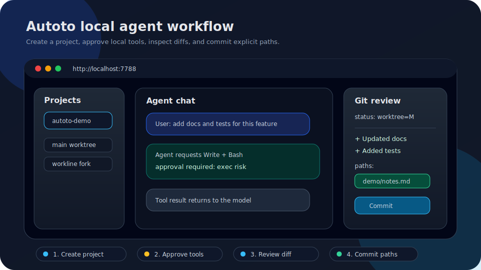

# Autoto

Autoto is a local-first coding-agent server that turns a task into a background run with approval-gated tools, a run summary, diff review, and an explicit-path local commit.

**Task → background run → approval → run summary → diff → explicit-path commit**



Autoto is an experimental local-development MVP, not an untrusted multi-user or production service. Its current remote control surface is deliberately narrow: Telegram uses Bot API long polling for private-chat pairing, minimal status, one-time tool approval, and denial. It is not a general IM assistant: there is no `/task`, free-form chat, Telegram webhook receiver, Slack, or Discord channel.

## Quick start

Requires Go 1.26 or newer:

```bash
go run ./cmd/autoto
```

Then open:

```text
http://localhost:7788
```

Default local state:

```text
Config:   ~/.autoto/config.json
Database: ~/.autoto/autoto.db
Projects: ~/projects
```

## Features

- Local HTTP server with embedded HTML/CSS/JS UI, using a no-build ES module seam for frontend bootstrap/runtime helpers and extracted Settings local-preference panels
- SQLite persistence for projects, worklines, agents, messages, tool calls, backend registry entries, and stdio MCP server registry entries
- Provider abstraction with a minimal `Tools` / `Streaming` / `ImageInput` capability contract for:
  - OpenAI official Responses API with SDK streaming text deltas and usage capture
  - Anthropic official Messages API with SDK streaming text deltas, tool-use deltas, usage capture, and automatic 5m prompt-cache breakpoints for sufficiently large requests
  - OpenAI-compatible Chat Completions APIs
  - CLIProxyAPI local OpenAI-compatible preset
- Core tools:
  - Read
  - Write
  - Edit
  - Bash
  - Glob
  - Grep
  - WebFetch
  - WebSearch
  - MCPListTools
  - MCPCallTool
- Sensitive-path hard blocking for the file path tools: `Read`, `Write`, and `Edit` reject protected files, while `Glob` and `Grep` omit them. The blocked set includes `.env*`, credential/secret files, common private-key material, and `.git` contents
- Git workspace APIs and UI for status, diff, log, and explicit-path commits without automatic push, amend, reset, clean, force, or `git add -A`
- Agent WebSocket protocol 2 on `/ws/agent`, with per-process monotonic sequence, bounded in-memory replay, and authoritative live-snapshot resync; it is not a durable or cross-process event log
- SQLite migrations V19–V22 and server APIs for schedules, durable notification deliveries, integration connections, channel pairings/events/cursors, and device-action requests
- Schedule worker with cron/`@every` expressions and IANA time zones. Schedule permission is limited to `readOnly` or `acceptEdits`, persists as a run permission cap, and skips a busy Agent without interrupting or replacing its manual run
- Durable Webhook/Telegram notification delivery history with deduplication, leases, exponential backoff, bounded attempts, delivered/dead states, aggregate metrics, and explicit retry
- Telegram Bot API long polling with private-chat `/pair`, `/status`, `/approve <toolCallId>` (always one-time `allow_once`), and `/deny <toolCallId> [reason]`; unauthenticated commands and failed pairing attempts are silent, and processed updates are protected by persisted event IDs and cursors
- Home Assistant integration restricted to local/private endpoints: read-only state/entity summaries, a fixed action allowlist, short-lived action requests, two local UI confirmations, and direct-loopback approval. Unknown/critical actions such as door unlock and camera snapshot are hard-blocked, and IM cannot control devices
- Local monitoring aggregation for active runs, pending approvals, schedules, delivery states, channels, device actions, and automation-worker health
- Runtime Supervisor lifecycle for preview, Telegram channel services, automation workers, and HTTP serving
- Workline and container settings backed by project Workline/Agent APIs, with backend workline-fork support that creates Git worktrees, merge-check preflight, and clean-worktree merge APIs
- Interactive PTY terminal WebSocket: `/ws/terminal`, with terminal-management controls and browser-local retention/focus preferences
- Filesystem browse/preview/mkdir APIs
- Agent Server backend registry with sidebar and Agent Admin management UI for compatible OpenHands Agent Server endpoints
- Settings modal search/filter with keyboard focus shortcut for quickly locating growing product configuration panels
- Chat message copy actions for exporting individual messages and the current conversation as Markdown
- Browser-local chat draft autosave/restore per Agent, including migration through local preference backups
- Browser-local prompt history for the chat composer, with empty-input ↑/↓ recall and migration through local preference backups
- Chat-composer slash command palette backed by enabled local Skills command templates
- Browser-local Settings → Profile preferences for display identity, avatar initials, workspace label, and Git identity helpers
- Browser-local Settings → Network Search policy preferences for provider presets, result limits, confirmation, and domain rules, plus `WebSearch` and `WebFetch` core tools for public web/documentation lookup
- Settings → P2–P3 automation control backed by server APIs for schedules, notification history/retry, Telegram and Home Assistant connection metadata, pairing/revocation, monitoring, device state, local device-action confirmation, and audit events. A detected legacy browser-local IM draft is shown only as a disabled migration hint and never starts a channel
- Server-backed Skills with global/project/workspace CRUD, effective-skill resolution, revision history/restore, and snapshot-stable cursor pagination. The Settings scoped panel can browse by scope, inspect details, paginate, and view/restore revisions; create, SKILL.md import, enable/disable, edit, and delete UI actions still operate only on global scope. MCP registry actions remain available with explicit exec-risk approval
- Browser-local Settings → Notifications preferences for toast categories, display duration, and UI terminal notices, plus server-backed durable Webhook/Telegram delivery history and retry
- Browser-local Settings → Appearance preferences for theme, density, terminal default visibility, and Agent event-log display
- Runtime summary endpoint and Settings → Servers/System + Runtime panels for process, Go runtime, paths, and Agent limits
- Settings → Users read-only auth status panel backed by `/api/auth/status`
- Local storage summary endpoint and Settings → Storage panel for config, database, home, and project-directory footprint
- Local usage summary endpoint and Settings → Usage panel for projects, messages, tool calls, model requests, estimated token cost, and backends
- Settings → About dependency-license panel backed by the development-time `/api/licenses` endpoint
- Settings → About browser-local preferences backup/import for migrating profile, skills, chat drafts, prompt history, search, IM, notification, appearance, terminal, recent directory, model, and relay-protocol settings

## Requirements

- Go 1.26 or newer, as declared in `go.mod`
- SQLite is provided through the pure-Go `modernc.org/sqlite` driver
- Node.js is optional and only used for `node --check` and `node --test` on embedded frontend scripts during validation

## Installation details

Tagged releases publish Autoto release assets for macOS, Linux, and Windows, named like `autoto_<version>_<os>_<arch>`. Download the matching asset from GitHub Releases, unpack it, then run the `autoto` binary.

From source:

```bash
go run ./cmd/autoto
```

Then open:

```text
http://localhost:7788
```

Default paths:

```text
Config:   ~/.autoto/config.json
Database: ~/.autoto/autoto.db
Projects: ~/projects
```

You can pass a custom config path:

```bash
go run ./cmd/autoto --config /path/to/config.json
```

## Dogfood demo (historical evidence)

The following tracked-file smoke was run before the rename, against temporary **CodeHarbor** servers and temporary Git repositories. It is retained as a historical record; the same current workflow uses the canonical Agent APIs shown below.

```text
Write: Wrote 197 bytes to demo/notes.md inside the temporary project worktree
Read:  confirmed the new tracked diff review line
Grep:  notes.md:4:- Updated through CodeHarbor Write tool for tracked diff review.
Status before commit: demo/notes.md was tracked and modified (worktree=M)
Diff:  demo/notes.md added=2 deleted=0
Patch excerpt:
  diff --git a/demo/notes.md b/demo/notes.md
  +- Updated through CodeHarbor Write tool for tracked diff review.
Commit: 96cd79e Dogfood tracked diff workflow
Paths:  demo/notes.md
After commit: clean=true, remainingFiles=[]
```

An earlier untracked-file smoke also created and committed `demo/notes.md` with commit `2484ab7 Dogfood CodeHarbor API workflow`.

`docs/demo.svg` is a lightweight tracked workflow preview. To replace it with a real product recording, capture a 15–20 second browser flow (create/open project → send task → approve tool call → review diff → commit selected path), compress it to a small asset, and update the README reference.

To reproduce manually, start Autoto with a temporary config, create or open a local Git repository as the project worktree, use the UI or tool-call API to write a small file, verify Git status, inspect the diff in the Git panel, select the file checkbox, enter a commit message, and submit the commit. The commit API stages only the selected paths and does not push, amend, reset, clean, force, or auto-stage the full worktree.

## Usage cost estimates

Autoto records provider usage in `api_requests` and shows aggregate estimated cost in Settings → Usage. Cost is calculated from a small built-in USD-per-million-token table in `internal/agent/loop.go`. The table was last reviewed on 2026-07-07 against public pricing pages: [OpenAI API pricing](https://developers.openai.com/api/docs/pricing), [OpenAI GPT-4.1 pricing announcement](https://openai.com/index/gpt-4-1/), and [Anthropic Claude pricing](https://docs.anthropic.com/en/docs/about-claude/pricing). Unknown models intentionally estimate to `0`, and OpenAI-compatible relay or local models may bill differently from their public model-name match.

## Configuration

On first run, Autoto creates a local config file if it does not exist. Runtime secrets can be supplied through environment variables. `config.json` includes a schema `version` field; legacy configs without it are loaded as version `1` and normalized in memory.

Agent-model environment variables:

```text
AUTOTO_DEFAULT_MODEL
AUTOTO_SUMMARY_MODEL
AUTOTO_CONTEXT_TOKEN_LIMIT
```

Provider environment variables:

```text
OPENAI_API_KEY
OPENAI_MODEL
ANTHROPIC_API_KEY
ANTHROPIC_MODEL
OPENAI_BASE_URL
OPENAI_COMPATIBLE_BASE_URL
OPENAI_COMPATIBLE_API_KEY
OPENAI_COMPATIBLE_MODEL
CLIPROXYAPI_BASE_URL
CLIPROXYAPI_API_KEY
CLIPROXYAPI_MODEL
CLIPROXYAPI_MANAGEMENT_KEY
CLIPROXYAPI_BIN
CLIPROXYAPI_CONFIG
```

### Automation integrations and secret references

Telegram and Home Assistant connections are stored as non-secret metadata plus logical secret references. The current reference format is only `env:VARIABLE_NAME`; plaintext bot/access tokens are rejected by the connection APIs and UI, and public responses expose only whether each required secret is configured.

For example, set the secret values in the Autoto process environment:

```sh
export AUTOTO_TELEGRAM_BOT_TOKEN='replace-with-current-bot-token'
export AUTOTO_HOME_ASSISTANT_TOKEN='replace-with-current-ha-token'
```

Then configure the connection with references such as:

```json
{
  "kind": "telegram",
  "name": "Personal Telegram",
  "secretRefs": { "botToken": "env:AUTOTO_TELEGRAM_BOT_TOKEN" }
}
```

```json
{
  "kind": "home-assistant",
  "name": "Home Assistant",
  "endpoint": "http://homeassistant.local:8123",
  "secretRefs": { "accessToken": "env:AUTOTO_HOME_ASSISTANT_TOKEN" }
}
```

Telegram is fixed to the official API endpoint and receives updates only through long polling. Generate a short-lived pairing code in the local UI/API, then send `/pair <code>` from a private chat. The accepted command set is `/status`, `/approve <toolCallId>` (one-time approval only), and `/deny <toolCallId> [reason]`. There is no `/task` or free-form assistant chat. Rotate the bot token if it may have leaked; the token revision changes and stale pairings are revoked, after which you must pair again. You can also revoke a pairing explicitly from the local UI/API.

Home Assistant endpoints must use loopback, `.local`, link-local, or private-network hosts. Rotate the Home Assistant token in the referenced environment variable if it may have leaked. Home Assistant has no channel pairing to revoke; disable/delete the connection and restart/retest it after rotation as appropriate.

### CLIProxyAPI preset

Autoto includes a built-in `cliproxyapi` provider profile for local [CLIProxyAPI](https://github.com/router-for-me/CLIProxyAPI) instances:

```text
Provider: cliproxyapi
Type:     openai-compatible
Base URL: http://127.0.0.1:8317/v1
Model:    gpt-5.5
```

Start CLIProxyAPI, then use **Settings → Providers → Codex 凭证 + 中转站** inside Autoto. Codex uses credential import: paste a Codex auth JSON, refresh token list, or token/account rows and import them directly into CLIProxyAPI; Autoto refreshes CLIProxyAPI auth files and `/v1/models` afterwards. The same page also includes an embedded relay/provider form for API Key, Base URL, protocol selection, and default model. Saving the form updates Autoto's runtime provider registry immediately and persists non-secret provider settings to `config.json`; API keys are intentionally not written to disk. You can pick a preferred model before creating a project, and Autoto will use it for the new Agent. To make new projects use the preset by default, start Autoto with `AUTOTO_DEFAULT_MODEL=cliproxyapi:gpt-5.5`. If your CLIProxyAPI config enables client `api-keys`, export `CLIPROXYAPI_API_KEY` before starting Autoto. You can override the local endpoint or fallback model with `CLIPROXYAPI_BASE_URL` and `CLIPROXYAPI_MODEL`. Autoto uses `CLIPROXYAPI_MANAGEMENT_KEY` for local management API calls.

Agent Server backend seed variables:

```text
AUTOTO_AGENT_BACKEND_URL
AUTOTO_AGENT_BACKEND_NAME
AUTOTO_AGENT_BACKEND_KIND
AUTOTO_AGENT_BACKEND_API_KEY
OPENHANDS_AGENT_SERVER_URL
OPENHANDS_SESSION_API_KEY
AGENT_SERVER_URL
AGENT_SERVER_API_KEY
```

If a backend URL is configured, Autoto seeds the backend registry on first startup. Local backends use `X-Session-API-Key`; cloud backends use `Authorization: Bearer ...`.

### Naming and migration compatibility

Canonical names for all new documentation, automation, and integrations are **Autoto**, `autoto`, `~/.autoto`, `AUTOTO_*`, `X-Autoto-*`, `autoto.*`, **Agent / Workline**, `/api/agents`, `/api/worklines`, and `/ws/agent`.

For a non-disruptive upgrade, Autoto continues to read the following legacy inputs:

- `~/.codeharbor/config.json` configuration, which is migrated into the canonical Autoto home when applicable
- `CODEHARBOR_*` environment variables as fallbacks for their `AUTOTO_*` counterparts
- `X-CodeHarbor-Token` and `X-CodeHarbor-Access` request headers alongside `X-Autoto-Token` and `X-Autoto-Access`
- `codeharbor.*` browser `localStorage` preference keys alongside canonical `autoto.*` keys
- legacy CodeHarbor CLI and Narrator/Chapter route aliases
- `window.CODEHARBOR_LOCAL_TOKEN`, which is still injected with the same value as canonical `window.AUTOTO_LOCAL_TOKEN` and read by `runtime.mjs` only as a fallback

Canonical values take precedence when both forms are present. Do not introduce new writes or dependencies on legacy names. The local-token JS global is an explicit compatibility-response-write exception until first-party runtime no longer reads it and the old-UI migration window is complete. The compatibility lifecycle and removal gates are defined only in `PROJECT_PLAN.md`; no legacy surface may be removed before v0.4.0 or without at least two tagged releases of migration runway.

## API overview

Core routes include:

```text
GET  /api/health
GET  /api/auth/status
GET  /api/settings
GET  /api/models
GET  /api/licenses
GET  /api/runtime/summary
GET  /api/storage/summary
GET  /api/usage/summary
GET  /api/monitoring/snapshot

GET  /api/notifications/settings
PUT  /api/notifications/settings
POST /api/notifications/test
GET  /api/notifications/deliveries
POST /api/notifications/deliveries/{id}/retry

GET    /api/schedules
POST   /api/schedules
PATCH  /api/schedules/{id}
DELETE /api/schedules/{id}
POST   /api/schedules/{id}/run

GET    /api/integrations/connections
POST   /api/integrations/connections
PATCH  /api/integrations/connections/{id}
DELETE /api/integrations/connections/{id}
POST   /api/integrations/connections/{id}/test

POST /api/channels/pairing-codes
GET  /api/channels/pairings
POST /api/channels/pairings/{id}/revoke
GET  /api/audit/events

GET  /api/devices?connectionId=...
POST /api/device-actions
POST /api/device-actions/{id}/approve
POST /api/device-actions/{id}/deny

PUT  /api/providers/{name}/config

GET  /api/providers/cliproxyapi/auth-files
POST /api/providers/cliproxyapi/auth-files/import

GET    /api/backends
POST   /api/backends
GET    /api/backends/{id}
PATCH  /api/backends/{id}
DELETE /api/backends/{id}
POST   /api/backends/{id}/activate
GET    /api/backends/{id}/health

GET    /api/mcp/servers
POST   /api/mcp/servers
GET    /api/mcp/servers/{id}
PATCH  /api/mcp/servers/{id}
DELETE /api/mcp/servers/{id}
GET    /api/mcp/servers/{id}/tools

GET  /api/projects
POST /api/projects
GET  /api/projects/{id}
GET  /api/projects/{id}/worklines

GET  /api/worklines/{id}
POST /api/worklines/{id}/fork
GET  /api/worklines/{id}/merge-check?targetWorklineId=...
POST /api/worklines/{id}/merge
GET  /api/worklines/{id}/agents

GET   /api/agents/{id}
PATCH /api/agents/{id}/cwd
PATCH /api/agents/{id}/model
PATCH /api/agents/{id}/permission-mode
GET   /api/agents/{id}/messages
POST  /api/agents/{id}/messages
GET   /api/agents/{id}/tools
POST  /api/agents/{id}/tool-calls
GET   /api/agents/{id}/tool-calls/{toolUseId}
GET   /api/agents/{id}/git/status
GET   /api/agents/{id}/git/diff
GET   /api/agents/{id}/git/log
POST  /api/agents/{id}/git/commit

GET  /api/fs/browse?path=...
GET  /api/fs/directories?path=...
GET  /api/fs/preview?path=...
POST /api/fs/mkdir

GET  /ws/agent?id={agentId}
GET  /ws/terminal?agentId={agentId}
```

Legacy clients can continue using `/api/projects/{id}/chapters`, `/api/chapters/...`, `/api/narrators/...`, and `/ws/narrator`; these compatibility aliases invoke the same canonical Agent/Workline handlers and return the canonical payload shape.

## Validation

Before committing changes, run the unified local check:

```bash
make check
```

If `make` is unavailable, run `./scripts/check.sh` directly. The check script verifies Go formatting without rewriting files, runs Go tests/vet/build, checks embedded JavaScript syntax, and runs embedded JavaScript tests. Use `make fmt` to apply Go formatting.

CI runs the same check script and additionally runs `golangci-lint` through `.github/workflows/ci.yml`. The server test suite includes an end-to-end smoke that starts a real `httptest` server, connects the Agent WebSocket, posts a message over HTTP, approves a model-requested Bash tool call, verifies tool-result feedback, and checks persisted messages/tool calls/API requests. Release tags matching `v*` run GoReleaser through `.github/workflows/release.yml`; use this only for publishing Autoto release assets, not for local validation.

## Security notes

Autoto is a local development MVP.

- Do not commit `.env`, local config files, SQLite databases, or API keys.
- The embedded UI and APIs are intended for trusted local use.
- Browser-originated API calls require a per-process local token injected into the UI, and WebSocket upgrades are restricted by Origin/Sec-Fetch-Site plus the same token.
- Public tunnel usage must add authentication. Non-loopback hosts, forwarded tunnel headers, or explicit `AUTOTO_EXPOSED=true`, enter remote-hardening mode: the UI/API require `AUTOTO_ACCESS_PASSWORD`, `bypassPermissions` is disabled, and the interactive terminal is off unless `AUTOTO_REMOTE_TERMINAL=true` is set.
- Git status/diff/log/commit APIs resolve the Agent repository and reject repositories outside the project path, configured default project directory, or the Agent Workline worktree path created by Autoto.
- Tools can read and write local files within their configured working directories. The file path tools hard-block sensitive names such as `.env*`, credentials/secrets, common private keys, and `.git`; this does not make Bash or stdio MCP safe, and both remain powerful local code execution.
- Schedule runs cannot exceed their persisted `readOnly`/`acceptEdits` permission cap. A busy Agent causes a skipped schedule record rather than cancellation or replacement of the manual run.
- Telegram uses outbound HTTPS plus long polling only. Pairing is private-chat and Agent-scoped; unauthenticated commands and failed pairing attempts are silent, approval is one-time, and `danger` tool uses cannot be approved from Telegram. Telegram cannot change permission mode, open a terminal, create `/task` runs, or control devices.
- Telegram bot tokens and Home Assistant access tokens must be supplied through `env:` references. Public integration responses do not return either the reference target or secret value. Rotate suspected credentials immediately; rotating the Telegram bot token invalidates stale pairings, and pairings can also be revoked locally.
- Home Assistant is restricted to local/private endpoints. State listing is read-only and attribute-filtered. Device changes use a fixed allowlist and require a short-lived request, two local UI confirmations, and direct-loopback approval; unknown or critical actions, including unlock and camera actions, are hard-blocked.
- Durable notification delivery records may include redacted operational metadata and status/error classes. Delivery retries use bounded exponential backoff and end in `dead`; they do not block the Agent loop.
- MCP server registry responses list environment variable names only; stored values are used for local process launch and are not returned by the public API.
- Backend API keys are not returned by the public API; responses only include `apiKeyConfigured`.
- Runtime, storage, and monitoring summary APIs intentionally expose local paths or operational diagnostics. The monitoring snapshot is local aggregation, not a cloud monitoring service, so keep the service bound to trusted local users.

See `SECURITY.md` for reporting and operational guidance.

## Third-party notices

See `THIRD_PARTY_NOTICES.md` for the initial direct dependency notice. It is a development aid and not legal advice. Before formal distribution, regenerate a complete transitive dependency notice with a license scanner such as `go-licenses`.

## Contributor docs

- `docs/ARCHITECTURE.md` explains how requests flow through server, Agent, provider, tools, WebSocket events, and persistence.
- `CHANGELOG.md` tracks user-visible changes, migration compatibility, security boundaries, and known release gaps.

## Roadmap

See `PROJECT_PLAN.md` for the current implementation plan, known limitations, and next milestones.

## License

Autoto is licensed under the MIT License. See `LICENSE`.
